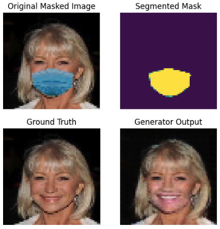

## MaskAway

### Project Background

The objective of this project is to develop a system that can effectively remove masks from people's faces in images. This involves a two-step process: first, segmenting the mask on the face and then reconstructing what the face should look like underneath using a Generative Adversarial Network (GAN).

### Introduction to the Problem

With the prevalence of facial masks in public settings, many facial recognition systems have encountered difficulties. This project addresses the challenge of digitally removing masks from images to restore facial features accurately. The task is divided into two main components:
1. **Segmentation**: Identify where the mask is on a person's face.
2. **Reconstruction**: Generate the unmasked part of the face.

### Data and Models

The dataset used in this project was generated using [MaskTheFace](https://github.com/aqeelanwar/MaskTheFace), modified to produce images of people with a mask, without a mask, and a binary overlay showing the mask location. The dataset and trained models are available in [this Google Drive folder](https://drive.google.com/drive/folders/1ju73lV7JwQr7km5mkPpsYthYtmzNIq3a?usp=sharing).

### Solution Overview

**Segmentation**:
- Implemented a U-Net architecture with skip connections, known for its effectiveness in segmentation tasks. The network takes a masked image as input and predicts a binary mask that highlights the mask's area.

**Generative Adversarial Network (GAN)**:
- Initial trials with a standard GAN showed unstable training and unsatisfactory results. Given the computational constraints (using a single NVIDIA T4 GPU) and the need for high-quality output, the model was transitioned to 64x64 resolution to manage resource usage effectively.
- Switched to a Wasserstein GAN with Gradient Penalty (WGAN-GP) to benefit from its stable training properties and reduced sensitivity to model architecture.
- The GAN setup involves:
  - Training the critic (discriminator) multiple times for each generator update to maintain balance between them.
  - Data augmentation and noise addition before feeding data into the discriminator to improve robustness and prevent overfitting.
  - Regularization and a carefully chosen architecture for the discriminator to ensure effective learning without overpowering the generator.

### Optimizations and Enhancements
- **Critic Training**: Adjusted the training frequency to ten times for the critic for every generator training iteration.
- **Dataset and Batch Size**: Used a subset of 100k images from a possible 200k for manageability, with a batch size of 16.
- **Model Configuration**:
  - **Critic**: Layers configured with 64 (with dropout), 64 (with dropout), 128, 256, 512.
  - **Generator**: Utilized a U-Net based architecture.
- **Learning Rate**: Implemented a decaying learning rate strategy to gradually reduce the learning rate, aiding in stabilizing training as it progresses.

### Example Output

Below is one of my favorite examples from the project. In the top right, you can see the output of our segmentation model, and in the bottom right, you can see the generator's output. Notice how the generated image infers that the person is smiling with their teeth, even though they weren't in the original image. This discrepancy highlights the model's interpretative capabilities, which, while not perfectly accurate, still aligns impressively with human features.

This example illustrates the effectiveness of the segmentation and generative models in handling complex facial expressions under occlusions like masks.

### Results and Future Work
The model performs exceptionally on the dataset but struggles with generalizing to real-world images not included in the training set. Future enhancements could include:
- Expanding the dataset size for training to include more varied examples.
- Increasing computational resources to allow for training on higher resolution images.
- Continuous tuning of hyperparameters to find an optimal balance for real-world applicability.

This project demonstrates significant potential in automated mask removal from facial images, with promising applications in various domains including security and social media. Further research and development could enhance its accuracy and generalization to diverse real-world scenarios.
